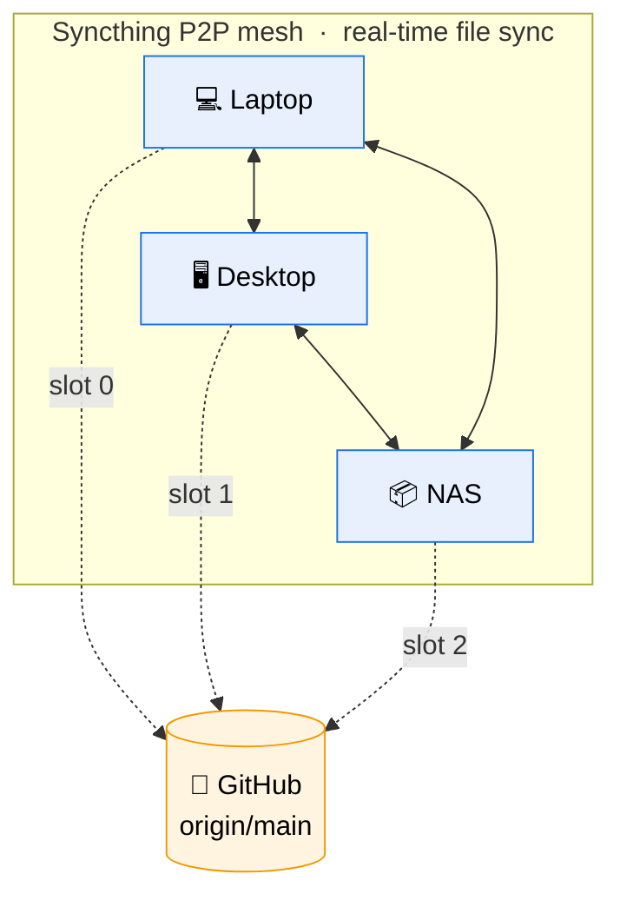

# dotkeeper

[](https://github.com/julian-corbet/dotkeeper/releases/latest)
[](LICENSE)
[](https://pkg.go.dev/github.com/julian-corbet/dotkeeper)
[](https://www.bestpractices.dev/projects/12584)
[](https://syncthing.net/)

Sync your repos and dotfiles across machines. Close the laptop, open the desktop, keep working.

dotkeeper combines **embedded Syncthing** for real-time P2P file sync with **git auto-backup** for history and rollback. Single binary, no external dependencies beyond git.

## The problem

You have more than one machine — a laptop, a desktop, maybe a NAS or a VPS — and you want the same code, configs, and dotfiles on all of them. Git requires manual commits and pushes. Syncthing alone has no history or rollback. Dotfile managers require manual commands and don't do real-time sync.

No existing tool combines P2P real-time sync with git history. dotkeeper does.

## How it works

dotkeeper connects **any number of machines** through two complementary layers — a live p2p sync layer and a staggered git backup layer.



**Solid lines** are the Syncthing mesh: every peer syncs directly with every other peer; edits propagate in seconds.
**Dashed lines** are the staggered git backups: each machine pushes on its own time slot, so no two machines ever race for the same push.

The diagram shows three peers for clarity, but the topology scales — add a phone, a VPS, a second laptop, etc. Each one gets the next slot number.

- **Syncthing** (embedded, isolated) builds the p2p mesh. Works on LAN, or through NAT over the public internet via Syncthing's discovery + relay infrastructure.
- **Git backup** auto-commits and pushes on a staggered schedule. Each machine owns a slot (`slot 0` at `:00`, `slot 1` at `:0 + slot_offset_minutes`, and so on), so no two machines try to push at the same moment.
- **`.git/` lives outside the Syncthing-synced tree.** Each machine keeps its own independent git history; machines converge through GitHub, not through bit-for-bit git-directory sync.
- **Every managed repo gets a `dotkeeper.toml` breadcrumb** — tracked in git — so if Syncthing is unreachable you can still tell from the repo alone which machines dotkeeper thinks manage it.

## Scaling to N machines

There's no "Machine A / Machine B" cap. Two, six, twenty — the model is the same:

- **Syncthing** forms a mesh; every machine syncs with every other machine directly (no central hub). Adding a machine is `dotkeeper join <DEVICE-ID-FROM-AN-EXISTING-MACHINE>`.
- **Slot assignment** is one per machine. With the default `git_interval = daily` and `slot_offset_minutes = 5`, you fit ~12 machines cleanly in a day. Tighter intervals (`hourly`, `2h`) are possible at the cost of more machines competing for the window.
- **Offline peers** catch up automatically: Syncthing replays missed changes when they come back online, then the next git-backup slot fires for that machine.

## What about conflicts?

Two layers, two failure modes, two mitigations:

### Live file conflicts (Syncthing)

If the same file is edited on two machines before Syncthing propagates the change, Syncthing keeps both versions — the loser becomes `<file>.sync-conflict-<timestamp>-<deviceID>.<ext>`. In practice this is rare because the latency is seconds and most humans only operate one machine at a time.

**What dotkeeper does:** actively detects *and auto-resolves* the trivial cases, and surfaces the rest. The default `[syncthing].ignore` list in `config.toml` keeps conflict files local (not re-synced to peers), and git's `.gitignore` typically excludes them too. On top of that:

- `dotkeeper start` runs a filesystem watcher. When a `.sync-conflict-*` file appears, dotkeeper:
  1. **Hash-identical dedup.** If the conflict file is byte-for-byte identical to the local file (two machines saved the same thing), it's deleted. Nothing to resolve.
  2. **3-way text merge.** For text files, dotkeeper runs `git merge-file` against the HEAD version as the common ancestor. A clean merge overwrites the local file, deletes the conflict file, and creates an auto-commit scoped to that single path (`auto: resolve sync conflict in <path>`) — reversible via `git revert` or `git reset` if it ever picks wrong.
  3. **Otherwise keep.** Binaries, files not yet committed to git, and merges that would produce conflict markers are left in place for the user to resolve by hand.
- `dotkeeper conflict list` prints a table of every outstanding conflict across all managed folders.
- `dotkeeper conflict resolve-all` runs the same resolver chain as a batch job — handy after an extended outage when many conflicts accumulate before the watcher was running.
- **Disabling auto-resolve.** Set `auto_resolve_conflicts = false` under `[sync]` in `config.toml` to revert to detect-only behaviour. Defaults to `true`.

**For the rare cases auto-resolve can't handle** — binaries, files not yet committed to git, or genuinely-conflicting text edits — `dotkeeper conflict list` shows the pending items and two manual commands resolve them: `dotkeeper conflict keep <path>` deletes the `.sync-conflict-*` variant and leaves the current file as-is (no git activity), while `dotkeeper conflict accept <path>` replaces the current file with the variant's contents, deletes the variant, and creates a single scoped commit (`auto: accept sync conflict for <relpath> (from <deviceShort>)`). Both accept either the canonical path or the explicit variant filename, both take `--all` to process every pending conflict in one invocation, and both are idempotent.

### Git push conflicts (GitHub)

Two machines pushing to the same branch at the same instant would race. The staggered-slot timer avoids this **by construction**: each machine's git backup fires at a different offset within the configured interval. No push races, no merge commits to clean up, no retries.

If a race does happen anyway (e.g. two machines start a manual `dotkeeper sync` at the same second): the losing push fails the fast-forward check, dotkeeper logs the failure, and the next timer tick on the losing machine pulls + retries. The content is already synced via Syncthing, so there's no data loss.

### State consistency

Because each machine keeps its own `.git/` outside the Syncthing tree, git history is **not** shared bit-for-bit — it converges via GitHub. A machine offline for a week comes back, Syncthing catches up its files within minutes, then its next slot commits and pushes whatever local changes remain. No manual reconciliation needed.

## Quick start

### Build and install

```bash
git clone https://github.com/julian-corbet/dotkeeper.git
cd dotkeeper
make build && make install
```

Or download a binary from [Releases](https://github.com/julian-corbet/dotkeeper/releases).

> **Note — building with `go install`**
>
> dotkeeper embeds Syncthing as a library, which transitively pulls in
> `lib/api`. That package expects a generator-produced `auto.Assets`
> symbol (Syncthing's web GUI). Since dotkeeper only uses the REST
> API, always build with the `noassets` tag:
>
> ```bash
> go install -tags noassets github.com/julian-corbet/dotkeeper/cmd/dotkeeper@latest
> ```
>
> The `Makefile`, `Dockerfile`, and release workflow all set this tag
> automatically. A naked `go build ./cmd/dotkeeper` will fail with
> `undefined: auto.Assets` — this is expected.

### First machine

```bash
dotkeeper init
# prints your device ID and a join command for peers to use

dotkeeper add ~/Documents/GitHub/my-project
dotkeeper add ~/.config/nvim
dotkeeper install-timer
```

### Each additional machine

Run this on every other machine you want to sync — laptop, desktop, NAS, VPS, etc. The same `join` command works for the 2nd, 20th, and every machine in between. Use the device ID from any already-joined machine.

```bash
dotkeeper join <DEVICE-ID-FROM-AN-EXISTING-MACHINE>
# connects to the mesh, syncs config, configures repos automatically

dotkeeper install-timer
```

That's it. All machines sync in real-time via Syncthing, with git backups running on each machine's staggered slot.

## Commands

| Command | Description |
|---------|-------------|
| `dotkeeper init` | Initialize this machine (identity, Syncthing, config) |
| `dotkeeper join <ID>` | Join an existing setup by pairing with another machine |
| `dotkeeper add <path>` | Add a repo or directory to sync |
| `dotkeeper remove <name>` | Stop syncing a repo |
| `dotkeeper pair` | Re-apply config (add devices and folders to Syncthing) |
| `dotkeeper sync` | Run git backup now |
| `dotkeeper status` | Show full status |
| `dotkeeper install-timer` | Install scheduled git backup (systemd/launchd/cron/schtasks) |
| `dotkeeper version` | Print dotkeeper version |
| `dotkeeper start` | Start embedded Syncthing in foreground (for systemd) |
| `dotkeeper stop` | Stop the Syncthing service |
| `dotkeeper conflict list` | List Syncthing sync-conflict files across all managed folders |
| `dotkeeper conflict resolve-all` | Scan managed folders and auto-resolve trivial conflicts (dedup + text merge) |
| `dotkeeper conflict keep <path>` | Delete the sync-conflict variant, keep the current file (`--all` for every pending conflict) |
| `dotkeeper conflict accept <path>` | Replace the current file with the variant and commit (`--all` for every pending conflict) |
| `dotkeeper doctor` | Run self-diagnostic checks; `--json` for machine-readable output |

## Configuration

### Three config files

| File | Location | Synced? | Purpose |
|------|----------|---------|---------|
| `machine.toml` | `~/.config/dotkeeper/` | No | Local machine identity (name, slot) |
| `config.toml` | `~/.config/dotkeeper/` | Yes (Syncthing) | Shared settings: machines, repos, ignore patterns |
| `dotkeeper.toml` | In each managed repo | Yes (git) | Per-repo log: which machines, when last synced |

### Backup schedule (`git_interval`)

| Value | Schedule |
|-------|----------|
| `hourly` | Every hour |
| `2h`, `6h`, `12h` | Every N hours |
| `daily` | Once per day (default) |
| `weekly` | Once per week |
| `monthly` | Once per month |

Each machine is offset by `slot * slot_offset_minutes` to avoid push conflicts.

### Ignore patterns

dotkeeper ships with smart defaults that sync lockfiles and editor configs while excluding build artifacts, caches, and conflict-prone state files. See `dotkeeper.toml.example` for the full list.

## Features

- **Single binary** — Syncthing embedded as a Go library, no separate install
- **Fully isolated** — own ports (18384, 12000, 11027), own config, won't interfere with system Syncthing
- **Works anywhere** — local discovery on LAN, global discovery + relay + NAT traversal when remote
- **Smart defaults** — syncs lockfiles and editor configs, excludes build artifacts and volatile state
- **Per-repo breadcrumbs** — `dotkeeper.toml` in each repo tracks sync state for resilience
- **Staggered git backup** — each machine gets a time slot, no push conflicts

## Port isolation

| Resource | System Syncthing | dotkeeper |
|----------|-----------------|-----------|
| API | 127.0.0.1:8384 | 127.0.0.1:18384 |
| Sync | :22000 | :12000 |
| Discovery | :21027 | :11027 |
| Config | ~/.config/syncthing | ~/.local/share/dotkeeper/syncthing |

## Requirements

- **Go 1.23+** (build only)
- **git**
- **Service manager** — systemd (Linux), launchd (macOS), Task Scheduler (Windows), cron (BSD/fallback)
- Internet access for cross-network sync (LAN-only also works)

## License

Copyright (C) 2026 Julian Corbet

This program is free software: you can redistribute it and/or modify it under the terms of the GNU Affero General Public License as published by the Free Software Foundation, version 3.

See [LICENSE](LICENSE) for the full text.

Syncthing (embedded) is licensed under the Mozilla Public License 2.0.
